# Avoin Raamatunkäännös (FinARK)

Avoin Raamatunkäännös™ (ARK) pohjautuu Kirkkoraamattuun 1933/38. Käännöksessä on korjattu joitakin aiempia virheitä, uudistettu kieliasua ja muokattu Uuden testamentin tekstiä vastaamaan bysanttilaista enemmistötekstiä. Tämä teksti pohjautuu niihin kreikankielisiin käsikirjoituksiin, jotka olivat laajassa käytössä Raamatussa mainituissa varhaisissa kristillisissä seurakunnissa muun muassa nykyisen Turkin ja Kreikan alueilla.

Alkuperäisiä kreikankielisiä käsikirjoituksia ei ole säilynyt, koska papyrukselle kirjoitetut tekstit kuluivat säännöllisen käytön ja Välimeren kostean ilmaston vaikutuksesta lopulta tomuksi. Diocletianuksen ajan vainoissa (303-311 jKr.) monia näistä varhaisista käsikirjoituksista myös poltettiin. Bysantin ajalta (noin 300-1500 jKr.) on kuitenkin säilynyt runsaasti uskollisesti tehtyjä kopioita, ja valtaosa nykyisin tunnetuista kreikankielisistä Uuden testamentin käsikirjoituksista kuuluu tähän bysanttilaiseen tekstiperheeseen. Vaikka nämä käsikirjoitukset on löydetty maantieteellisesti laajalta alueelta, ne ovat keskenään huomattavan yhteneviä.

Niissä kohdissa, joissa esiintyy toisistaan poikkeavia lukutapoja, oikea muoto voidaan useimmiten tunnistaa seuraamalla enemmistön mukaista lukutapaa. Robinson–Pierpontin tekstissä tämä valintatyö on jo tehty: kyseessä on tarkkaan koottu, bysanttilaiseen enemmistötraditioon perustuva Uuden testamentin teksti.

Tavoitteena on ollut tuottaa nykysuomeksi käännös, joka on uskollinen alkuseurakunnan käyttämille käsikirjoituksille. Käännöstyössä on pyritty mahdollisimman suureen sanatarkkuuteen aina silloin, kun se ei vaaranna tekstin ymmärrettävyyttä. Idiomien ja idiomaattisten ilmausten kohdalla painopiste on ollut alkuperäisen merkityksen välittämisessä sujuvalla suomen kielellä.

Käännös on avoin: sitä saa käyttää vapaasti, siihen voidaan tehdä parannuksia jatkuvasti, ja kaikki pohjateksteihin tehdyt muutokset ovat avoimesti nähtävillä osoitteessa:
[majorityversion.com/finark](https://majorityversion.com/finark)

Voit ladata käännöksen [tekstitiedostot](https://github.com/openversion/finark/tree/master/pub) ja käyttää niitä vapaasti omiin tarkoituksiisi.

## Sovellus

Voit lukea ja kuunnella käännöstä älylaitteilla tällä sovelluksella:
[openversion.net/finark/](https://openversion.net/finark/).

Älypuhelimella voit tallettaa sovelluksen kotivalikkoon ja se toimii myös lentotilassa ilman Internet-yhteyttä.

## Painettu Raamattu

Ensimmäinen painos Avoimesta Raamatunkäännöksestä on tulossa myyntiin kesän 2026 alussa. Raamattu on pehmeäkantinen, A5-kokoinen ja saatavilla neljässä eri värissä: sininen, musta, ruskea ja sinivalkoinen. 

Kannen hakemiston ja reunassa olevien palkkien avulla on helppo löytää haluttu kirja.

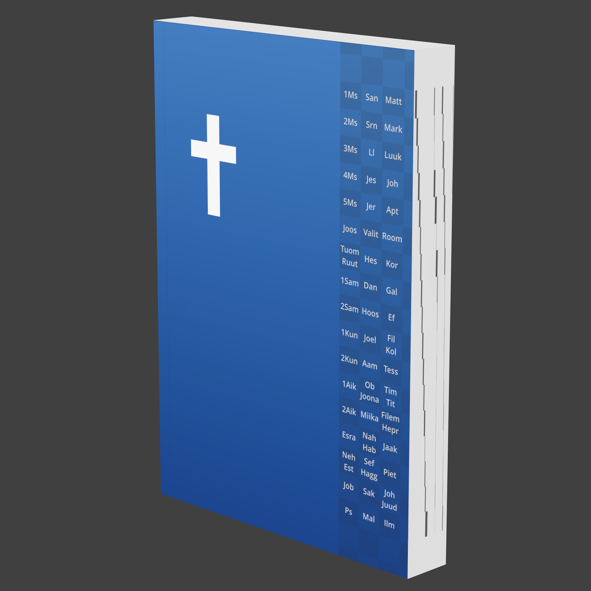 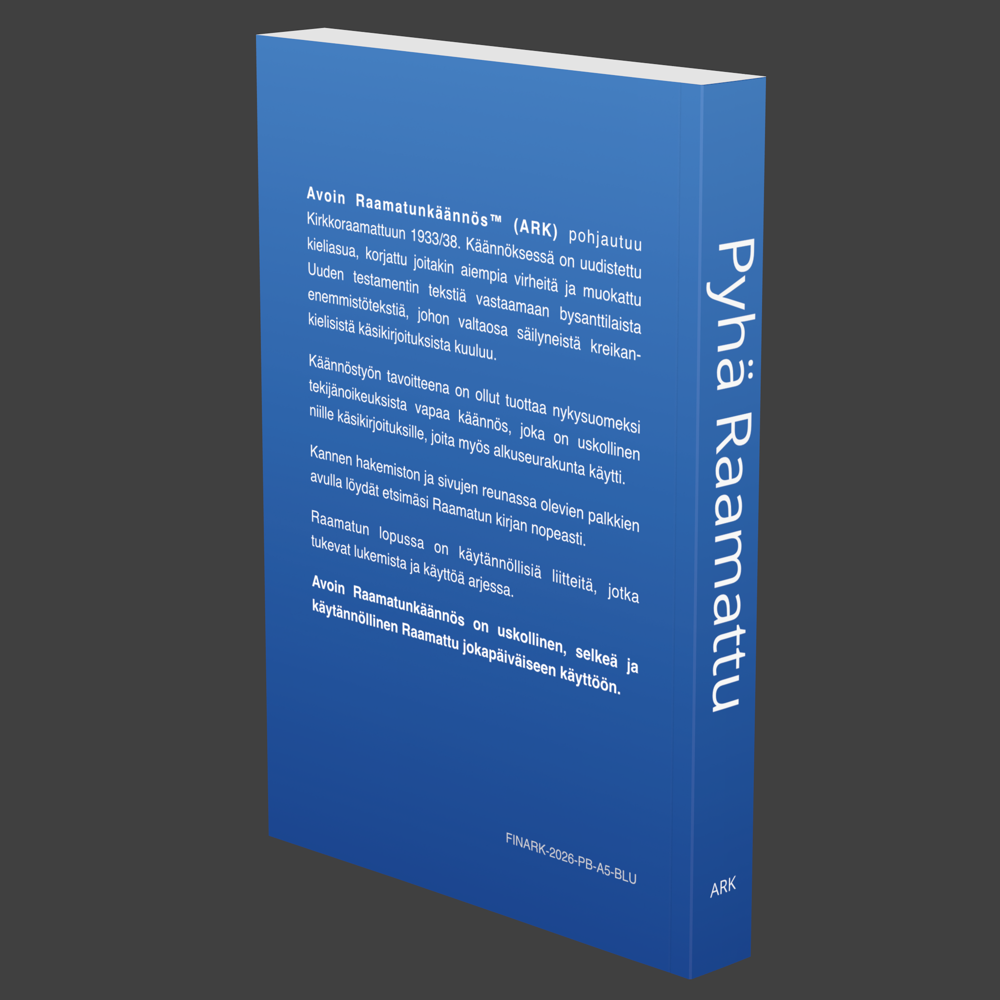

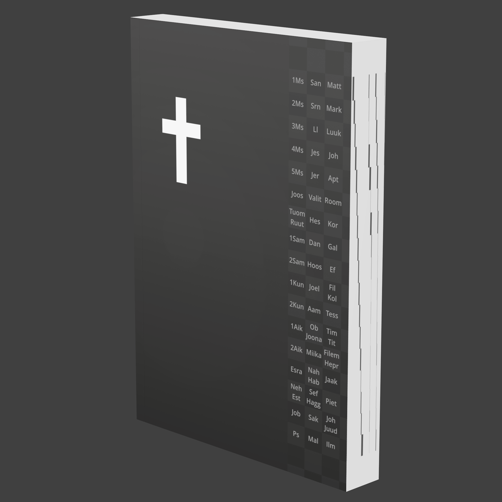 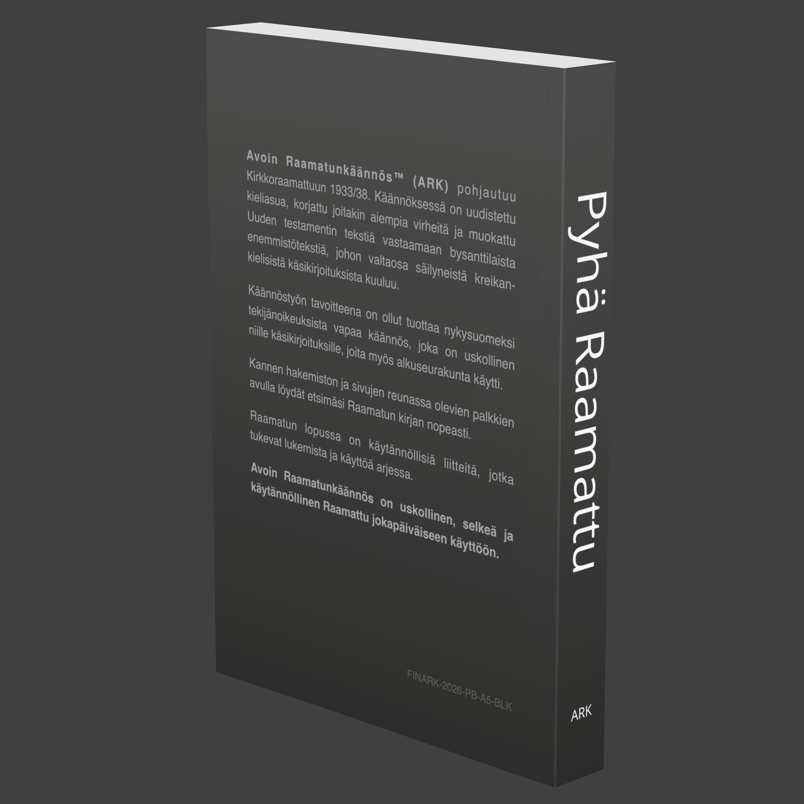

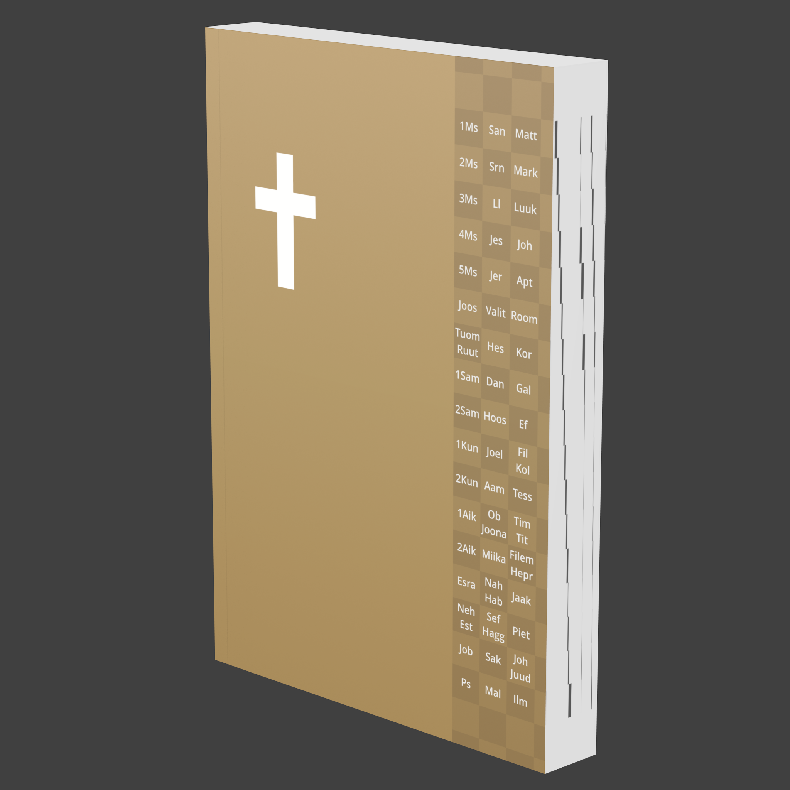 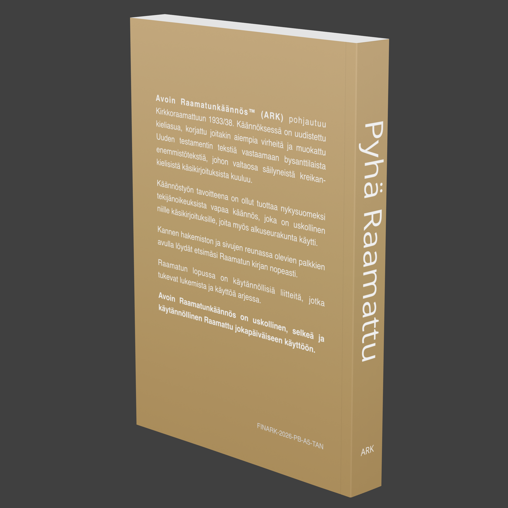

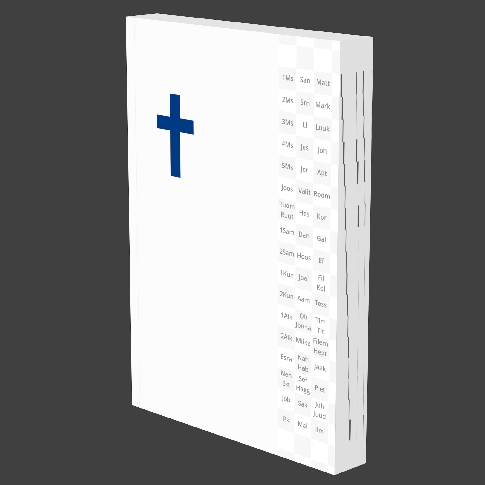 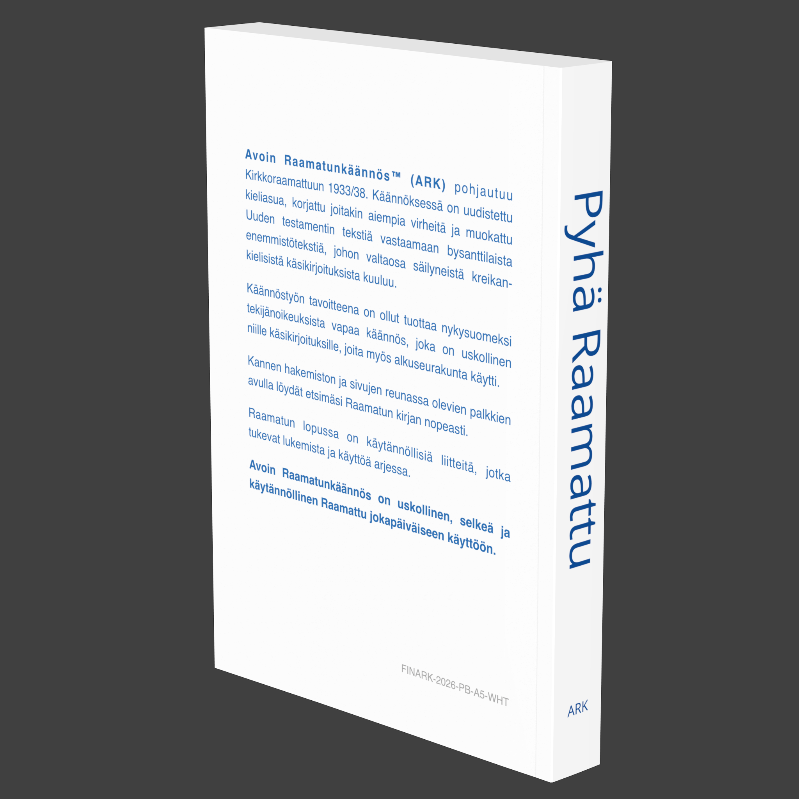

Raamatun teksti on selkeä ja helposti luettava, ja se on aseteltu kahteen palstaan.

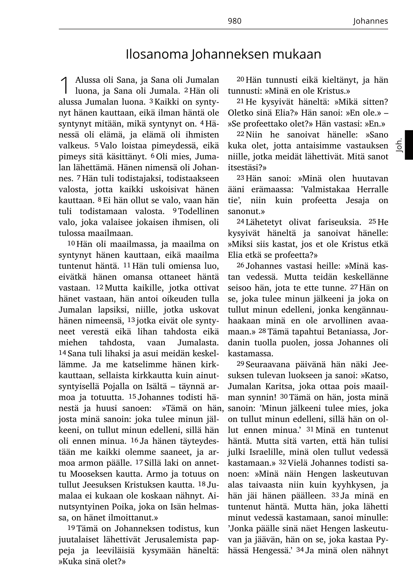

Raamatun lopussa on käytännöllisiä liitteitä, kuten esimerkiksi lukuohjelma ja kartat.

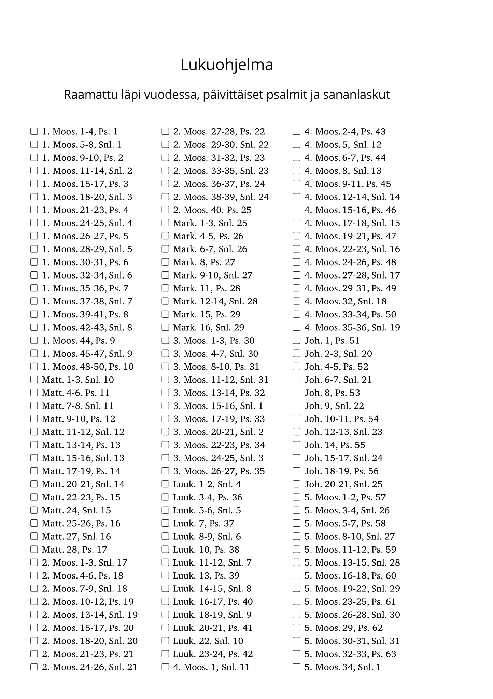

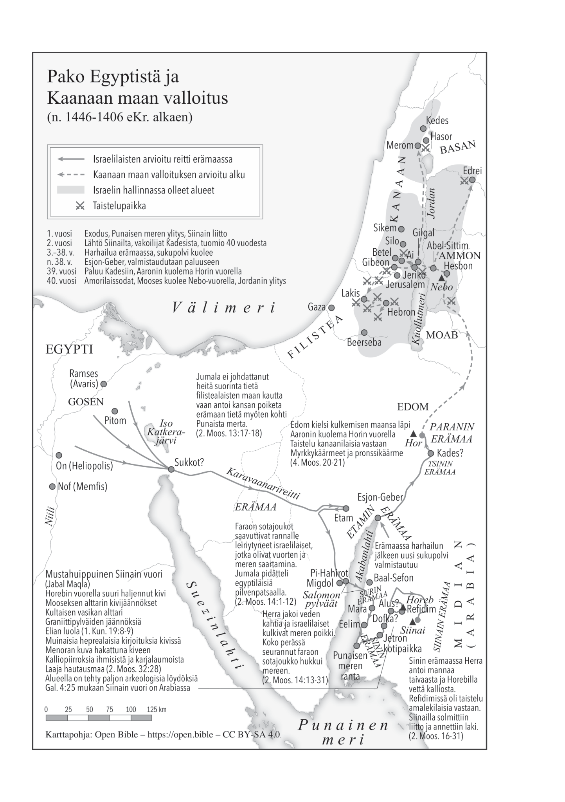

## Public domain -käännös

"Avoin Raamatunkäännös" on Seutulan rukoushuoneyhdistys Betel ry:n tavaramerkki. Nimeä Avoin Raamatunkäännös sekä sen lyhenteitä ARK ja FinARK saa käyttää ainoastaan viittaamaan tämän käännöksen virallisiin kopioihin, jotka on julkaistu seuraavilla verkkosivuilla:

[avoinraamattu.fi](http://avoinraamattu.fi), [github.com/openversion/finark](https://github.com/openversion/finark)

Itse käännös on vapaa tekijänoikeuksista (Public Domain) ja julkaistu CC0 1.0 -lisenssillä. Tämä tarkoittaa, että tekstiä saa vapaasti kopioida, muokata, levittää ja käyttää myös kaupallisiin tarkoituksiin ilman lupaa tai lähdeviitettä – kunhan käännöksen nimi ja lyhenteet säilytetään vain alkuperäisen version yhteydessä.
